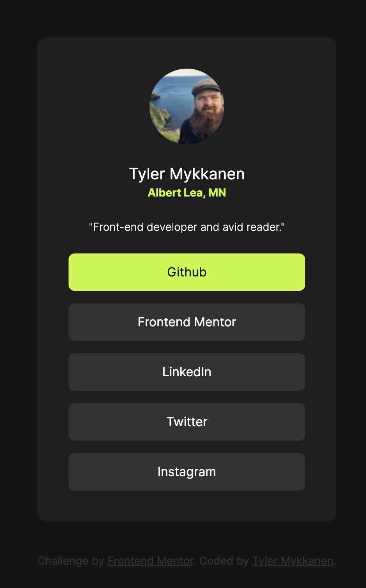

# Frontend Mentor - Social links profile solution

This is a solution to the [Social links profile challenge on Frontend Mentor](https://www.frontendmentor.io/challenges/social-links-profile-UG32l9m6dQ). Frontend Mentor challenges help you improve your coding skills by building realistic projects. 

## Table of contents

- [Overview](#overview)
  - [The challenge](#the-challenge)
  - [Screenshot](#screenshot)
  - [Links](#links)
- [My process](#my-process)
  - [Built with](#built-with)
  - [What I learned](#what-i-learned)
  - [Continued development](#continued-development)
- [Author](#author)

## Overview

### The challenge

Users should be able to:

- See hover and focus states for all interactive elements on the page

### Screenshot

### Links

- Solution URL: [fm-social-links-profile-main](https://github.com/tmykkanen/fm-social-links-profile-main)
- Live Site URL: [tlmfmsociallinksprofile.netlify.app](https://tlmfmsociallinksprofile.netlify.app/)

## My process

### Built with
- 
- 
- 
- 
- 
- 

### What I learned
- Improved skill at setting up astro project for rapid development.
- I learned how to stage changes to individual commits for a more granular development history.

### Continued development
- I'd like to get more efficient at project setup / consistent settings.
- I'd like to refine my use of semantic html and component based design.

## Author

- Github - [tmykkanen](https://github.com/tmykkanen)
- Frontend Mentor - [@tmykkanen](https://www.frontendmentor.io/profile/tmykkanen)